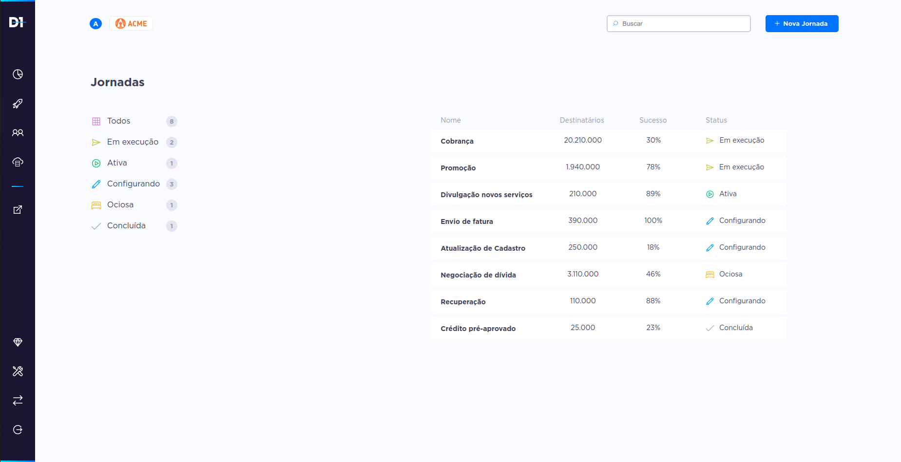

<h1 align="center">
    
</h1>

<p align="center">
  <a href="#-projeto">Projeto</a>&nbsp;&nbsp;&nbsp;|&nbsp;&nbsp;&nbsp;
  <a href="#-layout">Layout</a>&nbsp;&nbsp;&nbsp;|&nbsp;&nbsp;&nbsp;
  <a href="#-funcionalidades">Funcionalidades</a>&nbsp;&nbsp;&nbsp;|&nbsp;&nbsp;&nbsp;
  <a href="#-como-executar-o-projeto">Como executar</a>&nbsp;&nbsp;&nbsp;|&nbsp;&nbsp;&nbsp;
  <a href="#memo-licença">Licença</a>
</p>

---



---

## 💻 Projeto

  Este projeto tem o intuito de avaliar as habilidades, o conhecimento e experiência no desenvolvimento front-end em ReactJS e suas bibliotecas.

## 🔖 Layout

Você pode visualizar o layout do projeto através [desse link](https://xd.adobe.com/view/f41cc902-3388-42d8-826a-8cbd874656bb-a14f/).

## 🚀 Funcionalidades

Existe uma API com dados que precisam ser consumidos, nela contém um filtro e uma tabela, é preciso demonstrar esses dados por meio desse filtro, de forma que ao clicar nele apareça os dados referentes.

Para manipular e distribuir os dados foi utilizado o conceito de Context API e para utilizar a API foi usada a biblioteca Axios.

Além disso, como visto acima, há um layout com diversos detalhes a serem implementados, entre eles temos: sidebar com ícones, header, o filtro e tabela com os dados, etc e para isso foi utilizado a biblioteca Tooltip.

Cabe ressaltar que o site está completamente responsivo, funcionando em telas desktop, tablets e dispositivos móveis.

## ⌨ Como executar o projeto

```bash
# Clonar o repositório
git clone https://github.com/rodrigodsluz/d1-test.git

# Entrar no diretório
cd d1-test

# Baixar as dependências
yarn install

# Executar o site
yarn start
```

Feito isso, abra o seu navegador e acesse `http://localhost:3000/`

---

## :memo: Licença

Esse projeto está sob a licença MIT. Veja o arquivo [LICENSE](LICENSE.md) para mais detalhes.

---

Feito com ♥ por Rodrigo Duarte!


